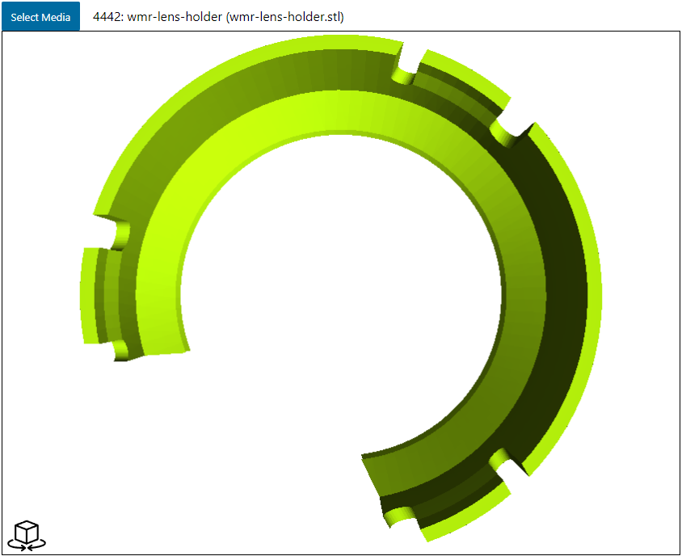
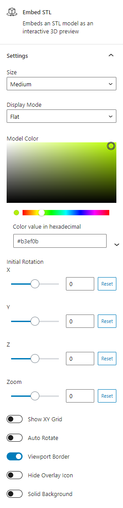

# embed-stl
WordPress plugin adding Gutenberg block for embedding STL previews

### Description
* Adds STL as a media type for uploads.
* Adds STL as a filter in media browser for picking items.
* Provides editor block for embedding a viewer, based on viewstl plugin.
** Editor block uses media browser to pick model.
** Options to set model color, background color, border, auto rotation, etc.
** Editor block updates with changes to match what live site would display.
* Relevant elements are prefixed to allow displaying multiple viewers on one site page.

### Screenshots

